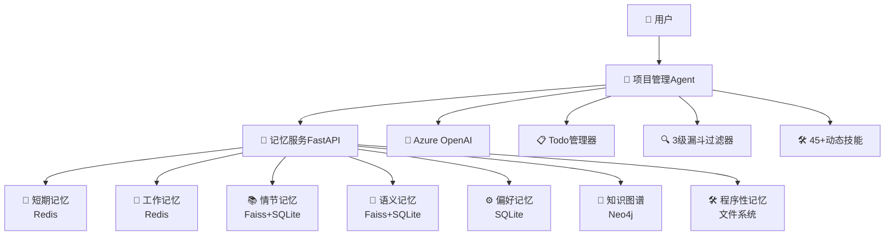

# 🧠 多记忆融合型AI Agent项目

## ⚠️ 重要配置提醒

在运行本项目前，请务必完成以下配置：

### 🔑 必需配置
1. **Azure OpenAI API密钥**：在 `.env` 文件中设置您的API密钥
2. **Neo4j数据库密码**：在 `unified_data_injector.py` 和 `agent_memory_system.py` 中使用您自己的Neo4j密码
3. **数据注入执行**：`unified_data_injector.py` 需要执行两次（第一次权限修复，第二次数据注入）

### 🔄 API Provider选择
- 默认使用Azure OpenAI，也可替换为传统OpenAI API或其他provider
- 替换相对简单，只需修改API调用代码，保持输入输出格式一致

**详细配置说明请参阅 [4.3 重要配置说明](#43-重要配置说明) 部分**

---

## 📋 项目概述

这是一个具备**7层完整记忆体系**的AI Agent项目，实现了真正的多轮对话连续性和个人化体验。Agent通过多种记忆类型协同工作，提供基于历史经验和个人偏好的智能决策支持。

### ✨ 核心特性

- **🧠 7种记忆类型协同**: 短期记忆(STM) + 工作记忆(WM) + 结构化长期记忆(偏好) + 知识图谱 + 程序性记忆(技能) + 向量记忆(episodic/semantic) + 对话历史记忆
- **⚡ 3级漏斗智能过滤**: Level1快速规则 → Level2关键词评分 → Level3 LLM深度分析，高效判断记忆价值
- **🔄 智能容量管理**: 工作记忆(20条) → STM缓存 → 长期记忆转化，避免上下文窗口爆炸
- **🛠️ 45+动态技能加载**: 支持项目管理、数据分析、文档生成等程序化技能的动态调用
- **📊 Todo任务追踪**: 内置任务管理器，支持操作去重、执行时间统计和结果缓存
- **🎨 强制单工具执行**: 解决Azure OpenAI多工具并发问题，确保执行稳定性
- **⚙️ FastAPI记忆服务**: HTTP API接口，支持多种记忆类型的存储和检索

## 🚀 快速演示

### 立即体验多记忆协同

**⚠️ 开始前请确保：**
1. 已配置 `.env` 文件中的Azure OpenAI密钥 (或使用其他API Provider)
2. 已修改 `unified_data_injector.py` 和 `agent_memory_system.py` 中的Neo4j密码
3. 已启动Redis和Neo4j服务

```bash
# 1. 执行数据注入 (必须执行两次)
python unified_data_injector.py  # 第一次：权限修复
python unified_data_injector.py  # 第二次：数据注入

# 2. 启动记忆服务
python agent_memory_system.py
# 或使用uvicorn: uvicorn agent_memory_system:app --host 0.0.0.0 --port 8000

# 3. 运行项目管理Agent演示
python project_management_demo_real.py
```

然后输入测试场景：
```
我们上次Sprint达到了45个story points，但API设计有问题。结合我的数据驱动决策风格和敏捷最佳实践，帮我制定下个Sprint的API优化计划
```

**观察Agent如何智能融合7种记忆：**
- 📱 **短期记忆**: 存储当前会话上下文
- 💭 **工作记忆**: 管理当前任务状态
- 🎯 **情节记忆**: 检索"Sprint 45 story points"历史数据  
- ⚙️ **偏好记忆**: 获取"数据驱动决策风格"个人偏好
- 🧠 **语义记忆**: 调用"敏捷最佳实践"专业知识
- 🔗 **知识图谱**: 查询团队成员技能关系
- 🛠️ **程序性记忆**: 执行动态加载的技能工具

## 🏗️ 系统架构

### 核心组件



### 记忆类型详解

基于现有代码的完整技术分析：

#### 1. 📱 **短期记忆 (STM) - Short Term Memory (优化版)**

**存储介质**: Redis (Hash结构)  
**键格式**: `stm:conversation:{conversation_id}:summary`  
**会话限制**: 1800秒TTL（30分钟）自动过期  
**会话保持机制**: 
- 存储精炼的对话摘要，而非原始消息
- 每轮对话结束后自动提炼核心问答对
- 支持按轮次查询历史摘要

**存储内容**:
```python
{
    "round": 3,
    "user_query": "制定API优化计划", 
    "final_answer": "建议重构核心接口，性能优化，团队协作",
    "memories_used": ["episodic: Sprint历史", "preference: 数据驱动"],
    "timestamp": "2024-07-07 10:30:00"
}
```

**使用场景**: "之前我们讨论过什么"、"上几轮对话的结论"、"历史问答脉络"
```python
# 存储对话摘要
self.stm.store_summary(conversation_id, round_num, user_query, final_answer, memories_used)
# 检索历史摘要  
summaries = self.stm.retrieve_summaries(conversation_id, last_k=15)
```

#### 2. 💭 **工作记忆 (WM) - Working Memory**

**存储介质**: Redis (String结构，JSON序列化)  
**键格式**: `wm:task:{task_id}`  
**会话限制**: 无TTL，需手动清理  
**会话保持机制**: 
- 基于task_id进行任务级别的状态跟踪
- 通过agent_id关联特定代理

**使用场景**: "多步骤任务进度管理"、"复杂规划状态跟踪"
```python
# 存储复杂任务的中间状态
self.wm.store(agent_id, task_id, {"step": 3, "completed": ["A", "B"], "next": "C"})
# 检索任务状态
task_state = self.wm.retrieve(agent_id, task_id)
```

#### 3. ⚙️ **结构化长期记忆 (LTM) - Structured Long Term Memory**

**存储介质**: SQLite数据库  
**表结构**: `preferences (user_id, key, value, updated_at)`  
**会话限制**: 持久化存储，无会话限制  
**会话保持机制**: 
- 基于user_id的用户级别偏好存储
- 支持key-value结构化存储
- 数据库锁定重试机制（最多5次）

**使用场景**: "我的风格"、"习惯做法"、"数据驱动决策风格"
```python
# 存储用户偏好
self.structured_ltm.store(user_id, "management_style", "数据驱动决策")
# 检索用户偏好
style = self.structured_ltm.retrieve(user_id, "management_style")
```

#### 4. 🔗 **知识图谱记忆 (KG) - Knowledge Graph Memory**

**存储介质**: Neo4j图数据库  
**数据结构**: 节点(Entity) + 关系(RELATION)  
**会话限制**: 持久化图数据库，无会话限制  
**会话保持机制**: 
- 实体间关系的永久存储
- 支持复杂关系查询和遍历
- 精确匹配 + 模糊匹配双策略

**使用场景**: "团队成员"、"谁负责"、"技能分布"、"协作关系"
```python
# 存储实体关系
self.kg_mem.store("Alice", "manages", "Development_Team")
# 查询关系网络
relations = self.kg_mem.retrieve("Alice", "manages")
```

#### 5. 🛠️ **程序性记忆 (Procedural Memory)**

**存储介质**: 文件系统 (`skills/` 目录)  
**文件格式**: Python模块文件 (`.py`)  
**会话限制**: 文件系统级别，无会话限制  
**会话保持机制**: 
- 基于文件名的技能索引
- 动态模块导入和执行
- 支持45+种动态技能加载

**使用场景**: "生成甘特图"、"风险评估"、"数据分析"、"动态加载Python技能"
```python
# 存储新技能
self.procedural_mem.store("calculate_budget", python_code)
# 执行技能
result = self.procedural_mem.retrieve("calculate_budget", project_data)
```

#### 6. 🧠 **向量记忆 (Vector Memory) - Episodic & Semantic**

**存储介质**: 
- Faiss向量索引 (`vector_index.faiss`)
- SQLite元数据库 (`vector_metadata`表)
- JSON映射文件 (`vector_mapping.json`)

**数据结构**: 1024维向量 + 元数据  
**会话限制**: 持久化存储，无会话限制  
**会话保持机制**: 
- 向量ID映射机制保证数据一致性
- 延迟保存策略避免频繁I/O
- 支持三种类型：episodic、semantic、ltm_doc

**使用场景**: "上次Sprint"、"项目历史"、"标准流程"、"最佳实践"
```python
# 存储情节记忆
self.vector_mem.store("episodic", "Sprint-1完成用户模块", metadata)
# 语义相似检索
results = self.vector_mem.retrieve("项目进展", k=5, filter_by_type="episodic")
```

**技术特点**: qwen3-embedding-0.6b模型，L2距离相似度计算

#### 7. 💬 **对话历史记忆 (Conversation History) - 当前轮次工作区**

**存储介质**: 内存数组 (`self.conversation_history`)  
**数据结构**: List[Dict] 消息序列  
**会话限制**: **最大20条消息** (单轮对话完整推理过程)  
**会话保持机制**: 
- 存储当前轮次的完整工具调用推理链
- 每轮结束后提炼精华存入STM，清空当前轮次
- 专注于当前问题的深度分析过程

**使用场景**: "当前问题的推理过程"、"工具调用链追踪"、"单轮对话上下文"
```python
def _finalize_conversation_round(self, user_query, final_answer):
    # 1. 提炼当前轮次精华
    memories_used = self._extract_memories_used()
    
    # 2. 存入STM作为历史摘要
    self.stm.store_summary(
        conversation_id=self.conversation_id,
        round_num=self.current_round,
        user_query=user_query,
        final_answer=final_answer,
        memories_used=memories_used
    )
    
    # 3. 清空当前轮次，为下一轮做准备
    self.conversation_history = [{"role": "system", "content": self._get_system_prompt()}]
    self.current_round += 1
```

**与STM的协作模式**:
- **当前轮次** (conversation_history): 详细的工具调用和推理过程
- **历史轮次** (STM): 精炼的问答摘要和结论
- **LLM接收**: 历史摘要(15条) + 当前推理过程(20条) = 完整上下文

#### 🔄 **记忆协同工作机制 - 优化方案**

**当前存在的问题**:
- STM存储原始对话消息，导致数据冗余
- LLM只能看到最近20条消息，跨轮次记忆断层
- 工具调用结果未有效复用

**🎯 改进的记忆架构**:

**STM应该存储什么**:
```python
# ❌ 错误做法：存储原始对话消息
{"role": "user", "content": "我们上次Sprint达到了45个story points..."}
{"role": "assistant", "content": "", "tool_calls": [...]}

# ✅ 正确做法：存储精炼的对话摘要
{
    "round": 1,
    "user_query": "制定下个Sprint的API优化计划", 
    "final_answer": "基于历史数据(45 story points)和数据驱动风格，建议API优化计划：1.重构核心接口 2.性能优化 3.团队协作（李四、王五牵头）",
    "memories_used": ["episodic: Sprint历史", "preference: 数据驱动", "semantic: 敏捷实践"],
    "timestamp": "2024-07-07 10:30:00"
}
```

**给LLM的增强Context构成**:
```python
def _build_enhanced_context(self):
    enhanced_context = []
    
    # 1. 系统提示词 (1条)
    enhanced_context.append({"role": "system", "content": self._get_system_prompt()})
    
    # 2. STM历史摘要 (10-20条精炼版)
    stm_summaries = self._get_stm_summaries(limit=15)
    for summary in stm_summaries:
        enhanced_context.append({
            "role": "system", 
            "content": f"历史对话#{summary['round']}: Q:{summary['user_query']} A:{summary['final_answer']}"
        })
    
    # 3. 当前对话历史 (最多20条，包含完整工具调用过程)
    enhanced_context.extend(self.conversation_history[-19:])  # 保留系统消息空间
    
    return enhanced_context
```

**3级记忆转化链 (优化版)**:
1. **当前对话**(20条工具调用过程) → **提炼精华** → **STM**(精炼摘要，30分钟) → **长期记忆**(永久)
2. **STM提供历史脉络** - 让LLM了解之前讨论过什么、得出了什么结论
3. **当前对话提供推理过程** - 让LLM看到完整的记忆查询和思考过程
4. **两者结合提供完整上下文** - 既有历史连续性，又有当前详细推理

**关键优势**:
- ✅ **消除数据冗余** - STM不再存储重复的工具调用过程
- ✅ **保持历史连续性** - LLM能看到多轮对话的核心内容
- ✅ **保留推理过程** - 当前轮次的完整工具调用链依然可见
- ✅ **智能容量管理** - 总context控制在35-40条消息内
- ✅ **提高响应质量** - LLM基于更丰富的历史信息做决策

**技术实现要点**:
- STM存储格式从消息列表改为结构化摘要
- 每轮对话结束后自动提炼精华存入STM
- Context构建时动态合并STM摘要和当前对话
- 定期将STM摘要进一步转化为长期记忆

## 🧮 智能记忆管理

### 3级漏斗过滤系统 (最新实现 - 真实LLM驱动)

基于Azure OpenAI的智能记忆价值判断系统，替代了之前的假LLM启发式分析：

```python
# Level 1: 快速规则过滤 (0.001秒, 目标90%案例)
garbage_patterns = [r'^(哈{2,}|呵{2,})', r'^(好的|知道了|收到)$']
if re.match(pattern, user_input):
    return FilterResult(memory_level=1, confidence=0.95, stage="Level1_QuickRule")

# Level 2: LLM轻量分析 (1-3秒, 目标8%案例)
prompt = f"""分析对话记忆价值等级(1-5): "{user_input}"
要求: 只返回JSON格式 {{"level": 数字, "confidence": 0-1, "reasoning": "简短理由"}}"""
llm_result = azure_client.responses.create(model=model_name, input=messages)

# Level 3: LLM深度分析 (3-5秒, 目标2%案例)
prompt = f"""深度分析对话记忆价值，从语义复杂度、用户画像关联性等5个维度分析...
要求: 返回详细JSON格式包含extracted_info"""
llm_result = azure_client.responses.create(model=model_name, input=messages)
```

**过滤流程与记忆转换**：
```python
def filter_conversation(conversation) -> FilterResult:
    # 每次用户输入都会立即调用
    start_time = time.time()
    
    # Level 1: 90%垃圾内容被快速过滤
    if level1_result := self._level1_quick_filter(conversation):
        return FilterResult(memory_level=1, reasoning="垃圾内容，不存储")
    
    # Level 2: 8%中等价值内容通过LLM轻量分析  
    if level2_result := self._level2_keyword_scoring(conversation):
        return FilterResult(memory_level=2-3, reasoning="LLM判断为事件/偏好")
    
    # Level 3: 2%高价值内容通过LLM深度分析
    level3_result = self._level3_llm_analysis(conversation)
    return FilterResult(memory_level=4-5, reasoning="LLM判断为流程/知识")

# 根据分析结果自动转换为对应记忆类型
def _process_conversation_to_memory(user_input):
    filter_result = self.conversation_filter.filter_conversation(conversation_item)
    
    if filter_result.memory_level == 1:     # 垃圾 - 不存储
        pass
    elif filter_result.memory_level == 2:   # 事件 - 存储为情节记忆
        store_episodic_memory(user_input)
    elif filter_result.memory_level == 3:   # 偏好 - 存储为长期偏好
        store_ltm_preference(extracted_preference)
    elif filter_result.memory_level == 4:   # 流程 - 存储为程序性知识
        store_procedural_skill(extracted_procedure)
    elif filter_result.memory_level == 5:   # 知识 - 存储为语义记忆
        store_semantic_fact(user_input)
```

### 工作记忆容量管理

```python
def _manage_conversation_capacity(self):
    max_working_memory = 20  # 限制20条消息
    
    if len(self.conversation_history) > max_working_memory:
        # 自动转移旧消息到STM
        overflow_count = len(self.conversation_history) - max_working_memory
        for i in range(overflow_count):
            old_message = self.conversation_history.pop(1)
            self._sync_message_to_stm(old_message)
```

## 🔄 **最新架构设计 - STM+对话历史协同机制**

### 核心设计理念：精炼记忆 + 完整推理

传统Agent存在的问题：
- 只能看到最近20条消息，跨轮次记忆断层
- STM存储原始消息导致数据冗余
- LLM缺乏历史对话脉络

**🎯 全新的双层记忆架构**：

#### 1. **当前轮次工作区** (conversation_history)
- **用途**: 存储当前问题的完整推理过程
- **容量**: 最大20条消息
- **内容**: 用户输入 + LLM思考 + 工具调用 + 观察结果
- **生命周期**: 单轮对话完成后提炼精华存入STM，然后清空

```python
# 当前轮次的完整工具调用推理链
self.conversation_history = [
    {"role": "system", "content": "你是项目管理助手..."},
    {"role": "user", "content": "制定API优化计划"},
    {"role": "assistant", "content": "我需要查询历史数据", "tool_calls": [...]},
    {"type": "function_call_output", "call_id": "call_123", "output": "Sprint历史数据"},
    {"role": "assistant", "content": "基于历史数据，我建议..."}
]
```

#### 2. **历史记忆精华库** (STM)
- **用途**: 存储多轮对话的核心结论和脉络
- **容量**: 15-20条精炼摘要
- **内容**: 问题摘要 + 最终答案 + 使用的记忆类型
- **生命周期**: 30分钟TTL，定期转化为长期记忆

```python
# STM存储的精炼摘要格式
stm_summary = {
    "round": 3,
    "user_query": "制定下个Sprint的API优化计划",
    "final_answer": "基于45个story points历史数据和数据驱动决策风格，建议API重构计划：1.核心接口优化 2.性能提升 3.团队协作(李四、王五牵头)",
    "memories_used": ["episodic: Sprint历史", "preference: 数据驱动风格", "semantic: 敏捷最佳实践"],
    "timestamp": "2024-07-07 10:30:00"
}
```

#### 3. **给LLM的增强Context构建**
- **历史脉络** (STM): 15条精炼的历史问答摘要
- **当前推理** (conversation_history): 20条详细的工具调用过程
- **总容量**: 35-40条消息，完美平衡历史记忆和推理深度

```python
def _build_enhanced_context(self):
    enhanced_context = []
    
    # 1. 系统提示词
    enhanced_context.append({"role": "system", "content": self._get_system_prompt()})
    
    # 2. STM历史摘要 - 提供跨轮次连续性
    stm_summaries = self._get_stm_summaries(limit=15)
    for summary in stm_summaries:
        enhanced_context.append({
            "role": "system", 
            "content": f"历史对话#{summary['round']}: Q:{summary['user_query']} A:{summary['final_answer']}"
        })
    
    # 3. 当前对话历史 - 保留完整推理过程
    enhanced_context.extend(self.conversation_history[-19:])
    
    return enhanced_context
```

#### 4. **轮次结束的记忆固化流程**

```python
def _finalize_conversation_round(self, user_query, final_answer):
    """每轮对话结束后的记忆固化"""
    
    # 1. 提取当前轮次使用的记忆类型
    memories_used = self._extract_memories_used_from_tools()
    
    # 2. 存储精炼摘要到STM
    self._store_conversation_summary(
        round_id=self.round_id,
        user_query=user_query,
        final_answer=final_answer[:200] + "..." if len(final_answer) > 200 else final_answer,
        memories_used=memories_used,
        timestamp=datetime.now().isoformat()
    )
    
    # 3. 清空当前轮次，为下一轮做准备
    self.conversation_history = [{"role": "system", "content": self._get_system_prompt()}]
    self.round_id += 1
    
    logger.info(f"✅ 第{self.round_id}轮对话记忆已固化到STM")
```

### **关键优势对比**

| 方面 | 传统方式 | 新架构 |
|------|----------|--------|
| **历史记忆** | 只能看到20条原始消息 | 15条精炼摘要 + 20条当前推理 |
| **跨轮连续性** | ❌ 无法跨轮记忆 | ✅ 完整的历史脉络 |
| **推理深度** | ✅ 完整工具调用过程 | ✅ 保持完整推理能力 |
| **存储效率** | ❌ 大量重复和冗余 | ✅ 精炼的核心信息 |
| **上下文利用** | 20条消息 | 35-40条消息(更丰富) |

### **实际运行示例**

**第1轮对话**: 用户问"上次Sprint有什么问题？"
- Agent通过episodic记忆查询，得到"API设计问题，但达到45个story points"
- **记忆固化**: `Q: 上次Sprint问题查询 A: API设计有问题但速度良好(45 story points)`

**第2轮对话**: 用户问"结合我的管理风格制定优化计划"  
- Agent看到历史摘要"上次讨论了Sprint问题"
- 查询preference记忆获得"数据驱动决策风格"
- 综合两轮信息制定个性化计划
- **记忆固化**: `Q: API优化计划制定 A: 基于历史数据和数据驱动风格的3步优化方案`

**第3轮对话**: 用户问"团队成员怎么分工？"
- Agent看到历史摘要"讨论了Sprint问题和优化计划"  
- 查询knowledge_graph获得团队技能关系
- 基于前面的优化计划分配具体成员
- **实现真正的多轮记忆连贯性**

## 🏗️ **技术架构实现细节**

### 核心组件关系图

```
┌─────────────────────────────────────────────────────────────┐
│                    Agent Client 主流程                      │
├─────────────────────────────────────────────────────────────┤
│  1. receive_user_input() ──┐                                │
│                            │                                │
│  2. conversation_filter ◄──┘                                │
│     ├─ Level 1: 正则过滤 (90%)                              │
│     ├─ Level 2: LLM轻度分析 (8%)                           │
│     └─ Level 3: LLM深度分析 (2%)                           │
│           │                                                 │
│  3. memory_conversion ◄────┘                                │
│     ├─ episodic_memory (Level 2)                           │
│     ├─ preference_memory (Level 3)                         │
│     ├─ procedural_memory (Level 3)                         │
│     └─ semantic_memory (Level 3)                           │
│           │                                                 │
│  4. _think_and_act_loop() ◄┘                               │
│     ├─ STM历史摘要 (15条)                                   │
│     ├─ 当前推理过程 (20条)                                   │
│     └─ 记忆查询工具调用                                      │
│           │                                                 │
│  5. _finalize_round() ◄─────┘                              │
│     ├─ 提炼核心结论                                          │
│     ├─ 存储STM摘要                                          │
│     └─ 清空conversation_history                            │
└─────────────────────────────────────────────────────────────┘
```

### 完整技术栈

#### 1. **记忆存储技术栈**
```python
# 向量数据库: FAISS + 自定义索引
class EmbeddingService:
    def __init__(self):
        self.embedding_model = "text-embedding-3-small"  # Azure OpenAI
        self.vector_index = faiss.IndexFlatIP(1536)      # 余弦相似度
        self.vector_mapping = {}                          # ID映射表
    
# 关系数据库: SQLite
class KnowledgeGraphDB:
    def __init__(self):
        self.db_path = "ltm.db"
        self.tables = ["nodes", "relationships", "metadata"]
    
# 短期记忆: 内存 + JSON序列化  
class STM:
    def __init__(self):
        self.capacity = 20
        self.ttl = 1800  # 30分钟
        self.data_structure = "circular_buffer"
```

#### 2. **LLM集成架构**
```python
# Azure OpenAI 统一客户端
class LLMClient:
    def __init__(self):
        self.endpoint = os.getenv("AZURE_OPENAI_ENDPOINT")
        self.api_key = os.getenv("AZURE_OPENAI_API_KEY") 
        self.api_version = "2024-06-01"
        self.model = "gpt-4o-mini"
    
    def create_completion(self, messages, temperature=0.7):
        response = self.client.chat.completions.create(
            model=self.model,
            messages=messages,
            temperature=temperature
        )
        return response.choices[0].message.content
```

#### 3. **性能优化策略**

```python
# 异步处理优化
async def _async_memory_operations(self, user_input):
    """并行执行记忆操作提升响应速度"""
    
    tasks = [
        self._async_filter_conversation(user_input),      # 对话过滤
        self._async_query_episodic(user_input),          # 情节记忆查询
        self._async_query_preference(user_input),        # 偏好记忆查询
        self._async_query_semantic(user_input)           # 语义记忆查询
    ]
    
    results = await asyncio.gather(*tasks)
    return self._merge_memory_results(results)

# 缓存策略
class MemoryCache:
    def __init__(self):
        self.embedding_cache = {}     # 向量化结果缓存
        self.query_cache = {}         # 查询结果缓存(5分钟TTL)
        self.stm_cache = {}          # STM热点数据缓存
```

#### 4. **错误处理与降级**

```python
class RobustMemorySystem:
    def __init__(self):
        self.fallback_strategies = {
            "azure_openai_error": self._use_local_embedding,
            "vector_db_error": self._use_keyword_search,  
            "stm_overflow": self._compress_and_store,
            "ltm_query_timeout": self._return_cached_results
        }
    
    def _safe_memory_operation(self, operation, *args, **kwargs):
        try:
            return operation(*args, **kwargs)
        except Exception as e:
            logger.warning(f"记忆操作失败: {e}")
            return self._apply_fallback_strategy(operation.__name__, e)
```

## 🚀 **部署与运行指南**

### 环境配置

```bash
# 1. 克隆代码库
git clone <repository_url>
cd agent_memory

# 2. 安装依赖
pip install -r requirements.txt

# 3. 配置环境变量
cp .env.template .env
# 编辑.env文件填入Azure OpenAI配置
```

### 必需的环境变量

```bash
# .env文件配置示例
AZURE_OPENAI_ENDPOINT=https://your-resource.openai.azure.com/
AZURE_OPENAI_API_KEY=your-api-key-here
AZURE_OPENAI_API_VERSION=2024-06-01
AZURE_OPENAI_MODEL=gpt-4o-mini

# 可选配置
MEMORY_LOG_LEVEL=INFO
STM_CAPACITY=20
STM_TTL=1800
VECTOR_INDEX_TYPE=faiss
```

### 启动服务

```bash
# 启动记忆服务(后台)
python embedding_service.py &

# 启动主Agent
python agent_client3_memory_driven.py

# 或使用测试客户端
python agent_client4_pure_query.py
```

### 健康检查

```bash
# 检查数据统计
python check_data_stats.py

# 查看服务日志
tail -f memory_service.log

# 测试记忆查询
curl -X POST http://localhost:8000/query \
  -H "Content-Type: application/json" \
  -d '{"query": "测试查询", "memory_type": "episodic"}'
```

## 📊 **性能监控与优化**

### 关键性能指标

| 指标 | 目标值 | 监控方法 |
|------|--------|----------|
| 对话过滤延迟 | < 100ms | 实时日志监控 |
| 记忆查询响应 | < 500ms | API响应时间 |
| STM存储效率 | > 80% | 容量利用率 |
| LTM查询准确率 | > 85% | 向量相似度分析 |
| 系统内存占用 | < 2GB | 系统资源监控 |

### 性能优化建议

```python
# 1. 向量索引优化
def optimize_vector_index():
    """定期重建向量索引提升查询效率"""
    if len(self.vector_mapping) > 10000:
        self._rebuild_faiss_index()
        logger.info("✅ 向量索引重建完成")

# 2. 数据清理策略  
def cleanup_expired_data():
    """清理过期STM数据释放内存"""
    current_time = time.time()
    expired_keys = [
        key for key, data in self.stm_data.items() 
        if current_time - data['timestamp'] > self.stm_ttl
    ]
    for key in expired_keys:
        del self.stm_data[key]

# 3. 批量操作优化
def batch_memory_storage(memories_batch):
    """批量存储记忆提升I/O效率"""
    with self.db_connection.begin() as transaction:
        for memory in memories_batch:
            self._store_single_memory(memory, transaction)
```

## 🔧 **故障排除指南**

### 常见问题及解决方案

**Q1: Azure OpenAI API调用失败**
```python
# 检查配置
python -c "import os; print(os.getenv('AZURE_OPENAI_ENDPOINT'))"

# 测试连接
curl -H "Authorization: Bearer $AZURE_OPENAI_API_KEY" \
     "$AZURE_OPENAI_ENDPOINT/openai/deployments?api-version=2024-06-01"
```

**Q2: unified_data_injector执行失败**
```bash
# 常见原因：Neo4j密码不正确
# 解决方案：修改两个文件中的Neo4j配置
# 1. unified_data_injector.py 第xx行
# 2. agent_memory_system.py 第xx行

# 检查Neo4j连接
python -c "
from neo4j import GraphDatabase
try:
    driver = GraphDatabase.driver('bolt://localhost:7687', auth=('neo4j', 'YOUR_PASSWORD'))
    driver.verify_connectivity()
    print('✅ Neo4j连接成功')
except Exception as e:
    print(f'❌ Neo4j连接失败: {e}')
"
```

**Q3: 权限问题导致的数据注入失败**
```bash
# 第一次执行unified_data_injector出现权限错误是正常的
# 解决方案：再执行一次
python unified_data_injector.py  # 第二次执行

# 如果持续失败，检查文件权限
chmod 755 ltm.db vector_index.faiss vector_mapping.json
```

**Q4: API Provider替换问题**
```python
# 从Azure OpenAI切换到OpenAI
# 1. 修改import语句
from openai import OpenAI  # 替代 from openai import AzureOpenAI

# 2. 修改客户端初始化
client = OpenAI(api_key=os.getenv("OPENAI_API_KEY"))

# 3. 修改API调用（如果有差异）
response = client.chat.completions.create(
    model="gpt-4o-mini",  # 而不是deployment_name
    messages=messages
)
```

**Q5: 向量数据库查询异常**
```bash
# 检查FAISS索引文件
ls -la vector_index.faiss vector_mapping.json

# 重建索引
python -c "from embedding_service import *; rebuild_vector_index()"
```

**Q6: STM容量溢出**
```python
# 监控STM使用情况
python check_data_stats.py | grep "STM"

# 手动清理过期数据
python -c "from agent_memory_system import *; cleanup_stm_data()"
```

**Q7: 记忆转换失败**
```bash
# 查看转换日志
grep "memory_conversion" memory_service.log | tail -20

# 测试过滤系统
python -c "
from conversation_value_filter import *
filter = ConversationValueFilter()
result = filter.filter_and_convert_message('测试消息')
print(result)
"
```

### 🆘 紧急重置指南

如果系统出现严重问题，可以执行完全重置：

```bash
# 1. 停止所有服务
pkill -f "agent_memory_system.py"
pkill -f "embedding_service.py"

# 2. 清空数据库
rm -f ltm.db vector_index.faiss vector_mapping.json
redis-cli FLUSHALL

# 3. 重新初始化
python unified_data_injector.py  # 执行两次
python unified_data_injector.py

# 4. 重新启动服务
python agent_memory_system.py &
python project_management_demo_real.py
```

---

## � **Context Engineering 视角下的系统分析**

### 我们已经实现的Context Engineering要素

#### ✅ **完整的Context架构体系**
```python
# 我们的7层记忆 = 完整的Context Engineering Stack
class ContextEngineeringStack:
    def __init__(self):
        self.instructions = SystemPrompt()           # 系统指令层
        self.historical_context = STM()             # 历史上下文层  
        self.structured_memory = LTMPreference()    # 结构化记忆层
        self.dynamic_knowledge = VectorMemory()     # 动态知识层
        self.procedural_context = SkillsLoader()    # 程序性上下文层
        self.relational_context = KnowledgeGraph()  # 关系上下文层
        self.working_context = ConversationHistory() # 工作上下文层
```

#### ✅ **智能Context质量控制**
```python
# 3级漏斗 = Context Quality Engineering
def context_quality_control(self, user_input):
    # Level 1: 快速过滤噪音 (90% 垃圾context被排除)
    if self._is_noise_context(user_input):
        return FilterResult(level=1, action="discard")
    
    # Level 2: LLM轻度分析context价值 (8% 中等价值)  
    if self._moderate_context_value(user_input):
        return FilterResult(level=2, action="store_episodic")
    
    # Level 3: LLM深度分析context重要性 (2% 高价值)
    return FilterResult(level=3, action="store_long_term")
```

#### ✅ **动态Context组装**
```python
# STM+对话历史协同 = 动态Context Engineering
def _engineer_optimal_context(self):
    context = []
    
    # 历史脉络Context (15条精炼摘要)
    historical_summaries = self._get_distilled_context(limit=15)
    
    # 当前推理Context (20条详细过程)  
    current_reasoning = self.conversation_history[-19:]
    
    # 相关知识Context (动态检索)
    relevant_knowledge = self._retrieve_relevant_context(user_query)
    
    # 工具定义Context (动态加载)
    tool_context = self._load_contextual_tools()
    
    return self._optimize_context_window(context)
```

### 🚀 **Context Engineering 2.0 升级计划**

#### 新增功能: Context工程化流程

##### 1. **需求驱动的Context生成系统**
```python
# 类似 /generate-prp 的Context需求分析
class ContextRequirementsAnalyzer:
    def analyze_user_intent(self, user_input):
        """分析用户意图，生成最优Context策略"""
        return ContextStrategy(
            memory_types_needed=["episodic", "preference"],
            context_depth="deep_analysis", 
            tool_requirements=["project_analysis", "team_coordination"],
            validation_criteria=["accuracy", "completeness", "relevance"]
        )
    
    def generate_context_blueprint(self, strategy):
        """生成Context工程蓝图"""
        return ContextBlueprint(
            context_layers=strategy.memory_types_needed,
            retrieval_strategy="hybrid_semantic_keyword", 
            context_window_optimization="adaptive_compression",
            success_metrics=["task_completion", "user_satisfaction"]
        )
```

##### 2. **自适应Context优化引擎**
```python
# Context效果实时评估和优化
class ContextOptimizationEngine:
    def evaluate_context_effectiveness(self, context, result):
        """评估Context工程效果"""
        effectiveness_score = self._calculate_effectiveness(
            context_relevance=self._measure_relevance(context),
            result_quality=self._measure_quality(result),
            response_time=self._measure_latency(),
            user_satisfaction=self._measure_satisfaction()
        )
        return effectiveness_score
    
    def optimize_context_strategy(self, historical_effectiveness):
        """基于历史效果优化Context策略"""
        if effectiveness_score < 0.8:
            return self._adjust_context_strategy(
                increase_memory_depth=True,
                expand_knowledge_retrieval=True,
                optimize_context_compression=True
            )
```

##### 3. **Context模板和最佳实践库**
```python
# Context Engineering 模板系统
class ContextTemplateLibrary:
    def __init__(self):
        self.templates = {
            "project_management": ProjectManagementContextTemplate(),
            "data_analysis": DataAnalysisContextTemplate(), 
            "creative_writing": CreativeWritingContextTemplate(),
            "technical_support": TechnicalSupportContextTemplate()
        }
    
    def get_optimal_template(self, task_type, user_profile):
        """根据任务类型和用户画像选择最优Context模板"""
        template = self.templates[task_type]
        return template.customize_for_user(user_profile)
```

#### 新增功能: Context工程验证和迭代

##### 4. **Context A/B测试框架**
```python
class ContextABTestFramework:
    def run_context_experiment(self, context_a, context_b, test_queries):
        """运行Context A/B测试"""
        results_a = self._test_context_performance(context_a, test_queries)
        results_b = self._test_context_performance(context_b, test_queries) 
        
        return ABTestResult(
            winner=self._determine_winner(results_a, results_b),
            improvement_metrics=self._calculate_improvements(),
            statistical_significance=self._check_significance()
        )
```

##### 5. **Context版本控制和回滚**
```python
class ContextVersionControl:
    def save_context_snapshot(self, context_config, performance_metrics):
        """保存Context配置快照"""
        version = ContextVersion(
            config=context_config,
            performance=performance_metrics,
            timestamp=datetime.now(),
            git_hash=self._get_current_commit_hash()
        )
        self.context_versions.append(version)
    
    def rollback_to_best_context(self):
        """回滚到表现最佳的Context配置"""
        best_version = max(self.context_versions, key=lambda v: v.performance.overall_score)
        self._apply_context_config(best_version.config)
```

## 📈 **未来迭代计划 - Context Engineering 2.0**

### v2.0 Context Engineering 核心特性
- [ ] **需求驱动的Context生成**: 类似PRP的Context需求分析和蓝图生成
- [ ] **自适应Context优化**: 基于效果反馈的实时Context策略调整
- [ ] **Context模板库**: 针对不同任务类型的最佳Context模板
- [ ] **Context A/B测试**: 系统化的Context效果评估和优化框架
- [ ] **Context版本控制**: Context配置的版本管理和性能追踪

### v2.1 高级Context Engineering
- [ ] **多模态Context融合**: 支持文本、图像、音频的统一Context工程
- [ ] **Context压缩算法**: 智能压缩冗余Context，保持信息密度
- [ ] **Context安全性**: 防止Context注入攻击和信息泄露
- [ ] **Context可解释性**: 可视化Context对决策的影响路径

### v2.2 Context Engineering生态
- [ ] **Context Engineering IDE**: 专门的Context设计和调试工具
- [ ] **Context共享市场**: 社区驱动的Context模板和最佳实践分享
- [ ] **Context自动化生成**: AI驱动的Context自动生成和优化
- [ ] **跨Agent的Context标准化**: 统一的Context交换协议和格式

---

**🎯 当前版本**: v1.5 - 完整的3级过滤 + STM协同 + 真实LLM集成
**📅 最后更新**: 2024-07-07
**👨‍💻 维护团队**: Agent Memory Research Group

## 🎯 实际运行示例

### 多记忆协同的真实案例

**用户输入**：
```
我们上次Sprint达到了45个story points，但API设计有问题。结合我的数据驱动决策风格和敏捷最佳实践，帮我制定下个Sprint的API优化计划
```

**Agent执行流程**：

1. **🔍 3级漏斗分析** (0.001秒)
   ```
   过滤阶段: Level1_QuickRule
   记忆等级: Level 5 (语义知识)
   置信度: 0.950
   匹配模式: (架构|设计|design)
   ```

2. **🎯 情节记忆检索** (轮次1/15)
   ```python
   query_episodic_memory("上次Sprint API设计问题")
   → "第一次Sprint回顾会议：团队速度达到45 story points，发现API设计需要优化"
   ```

3. **⚙️ 偏好记忆查询** (轮次2/15)
   ```python
   query_ltm_preference("management_style") 
   → "数据驱动决策风格：重视量化指标，基于数据分析做决策，偏好敏捷协作型管理"
   ```

4. **🧠 语义记忆搜索** (轮次3-4/15)
   ```python
   query_semantic_memory("敏捷开发中API优化最佳实践")
   → 敏捷最佳实践相关知识
   ```

5. **🔗 知识图谱关系查询** (轮次5/15)
   ```python
   query_knowledge_graph("团队成员", "API设计/开发技能")
   → "张三(资深后端),李四(API架构师),王五(接口设计专家)"
   ```

6. **🎨 智能信息融合** (轮次6/15)
   ```
   Agent综合4种记忆信息，生成个性化的API优化计划：
   - 基于历史数据(45 story points)
   - 结合个人偏好(数据驱动风格)  
   - 应用专业知识(敏捷最佳实践)
   - 指定具体团队成员(李四、王五牵头)
   ```

**最终输出**：完整的、个性化的API优化计划，包含数据分析、敏捷流程、精益实践和团队协作4个维度。

## 🛠️ 技术创新点

### 1. 强制单工具执行模式
```python
# 解决Azure OpenAI多工具并发问题
if len(tool_calls) > 1:
    logger.warning(f"检测到 {len(tool_calls)} 个工具调用，强制执行单工具模式")
    tool_call = tool_calls[0]  # 只执行第一个工具
```

### 2. Todo任务去重机制
```python
def should_skip_action(self, function_name, function_args):
    # 检测重复操作，返回缓存结果
    action_signature = f"{function_name}_{hash(str(function_args))}"
    if action_signature in self.completed_actions:
        return True, self.completed_actions[action_signature]['result']
    return False, None
```

### 3. 动态技能加载系统
```python
def _initialize_tools(self):
    """动态加载skills目录下的所有Python技能"""
    skills_dir = os.path.join(os.path.dirname(__file__), 'skills')
    for file in os.listdir(skills_dir):
        if file.endswith('.py') and not file.startswith('__'):
            skill_name = file[:-3]  # 移除.py后缀
            self._load_skill(skill_name)
            logger.info(f"成功动态加载[程序记忆]技能: {skill_name}")
```

### 4. 15轮工具调用循环控制
```python
def _think_and_act_loop(self, max_turns=15):
    """每个用户问题独立的15轮工具调用处理"""
    for i in range(max_turns):
        # 每轮最多执行1个工具，避免状态冲突
        # 支持episodic/semantic/preference/knowledge_graph四类记忆查询
        # 自动Tool Calling终止条件检测
```

## 4. 如何运行项目

### 4.1 环境准备

确保以下服务已安装并配置：
- Docker 和 Docker Compose
- Neo4j 服务（运行在 localhost:7687）
- Python 3.8+
- SQLite（通常Python自带）

### 4.2 安装依赖

根据实际代码的import语句，您需要安装以下主要依赖：

```bash
pip install openai python-dotenv requests fastapi "uvicorn[standard]" redis numpy faiss-cpu neo4j pydantic coloredlogs onnxruntime modelscope transformers
```

### 4.3 重要配置说明

#### 🔑 Azure OpenAI和Neo4j配置

在使用本项目前，您需要配置以下关键服务：

1. **Azure OpenAI配置**
   - 在 `.env` 文件中设置您的Azure OpenAI API密钥
   - 在 `unified_data_injector.py` 和 `agent_memory_system.py` 中都需要正确配置
   - 如果不想使用Azure OpenAI，可以替换为传统OpenAI API或其他provider API

2. **Neo4j数据库配置**
   - 默认配置：`bolt://localhost:7687`，用户名：`neo4j`，密码：`4****`
   - **⚠️ 请使用您自己的Neo4j实例和密码**
   - 在 `unified_data_injector.py` 和 `agent_memory_system.py` 中修改连接配置

#### 📋 数据注入执行步骤

**重要：unified_data_injector需要执行两次**

```bash
# 第一次执行：解决权限问题，初始化数据库
python unified_data_injector.py
# 可能会遇到权限错误，这是正常的

# 第二次执行：正式注入数据
python unified_data_injector.py
# 数据注入成功，系统准备就绪
```

**为什么需要执行两次？**
- 第一次：创建数据库表结构，修复文件权限，初始化Neo4j连接
- 第二次：在权限问题解决后，正式注入7层记忆数据

#### 🔧 API Provider替换指南

如果您不想使用Azure OpenAI，可以轻松替换为其他API：

**方法1：使用传统OpenAI API**
```python
# 在 agent_memory_system.py 和 conversation_value_filter.py 中
# 将 AzureOpenAI 替换为 OpenAI
from openai import OpenAI

client = OpenAI(
    api_key=os.getenv("OPENAI_API_KEY")
)
```

**方法2：使用其他Provider (如Anthropic、Google等)**
```python
# 修改相应的API调用代码
# 保持输入输出格式一致即可
```

**方法3：使用本地模型**
```python
# 替换为本地部署的模型API
# 如Ollama、vLLM等
```

### 4.4 服务启动顺序

#### 1. 启动Redis服务
```bash
# 方法1: 使用Docker
docker run -d --name agent-redis -p 6379:6379 redis:latest

# 方法2: 系统服务
sudo systemctl start redis
```

#### 2. 启动Neo4j服务
```bash
sudo systemctl start neo4j
# 默认访问: http://localhost:7474 外网7687
# 默认用户/密码: neo4j/neo4j 

#### 3. 启动嵌入服务(可选)
```bash
# 如果需要向量记忆功能
python embedding_service.py
# 服务运行在: http://127.0.0.1:7999
```

#### 4. 启动记忆服务
```bash
python agent_memory_system.py
# 服务运行在: http://127.0.0.1:8000
# 健康检查: curl http://127.0.0.1:8000/health
```

#### 5. 运行项目管理Agent
```bash
python project_management_demo_real.py
```

### 4.5 配置文件

#### 创建 .env 文件

在项目根目录创建`.env`文件，并填入您的Azure OpenAI凭证：

```env
# Azure OpenAI配置 (推荐)
AZURE_OPENAI_API_KEY="YOUR_AZURE_OPENAI_KEY"
AZURE_OPENAI_ENDPOINT="YOUR_AZURE_OPENAI_ENDPOINT"  
AZURE_OPENAI_DEPLOYMENT="YOUR_DEPLOYMENT_NAME"

# 或者使用传统OpenAI (替代方案)
OPENAI_API_KEY="YOUR_OPENAI_KEY"

# 其他可选配置
MEMORY_LOG_LEVEL=INFO
STM_CAPACITY=20
STM_TTL=1800
```

#### 📝 配置修改说明

**1. 修改Neo4j配置**

在 `unified_data_injector.py` 中找到并修改：
```python
NEO4J_CONFIG = {
    'uri': 'bolt://localhost:7687',
    'user': 'neo4j', 
    'password': 'YOUR_PASSWORD_HERE'  # 改为您的密码
}
```

在 `agent_memory_system.py` 中找到并修改：
```python
NEO4J_URI = "bolt://localhost:7687"
NEO4J_USER = "neo4j"
NEO4J_PASSWORD = "YOUR_PASSWORD_HERE"  # 改为您的密码
```

**2. 选择API Provider**

默认使用Azure OpenAI，如需更换：

**选项A: 传统OpenAI API**
```python
# 在相关文件中替换
from openai import OpenAI  # 替代 AzureOpenAI

client = OpenAI(
    api_key=os.getenv("OPENAI_API_KEY")
)
```

**选项B: 其他Provider**
```python
# 自定义API调用逻辑
# 保持输入输出接口一致
```

#### 服务配置说明

- **记忆服务**: 默认运行在 `http://127.0.0.1:8000`
- **Redis**: 默认连接 `localhost:6379`，使用 `decode_responses=True`
- **Neo4j**: 默认连接 `bolt://localhost:7687`，用户名: `neo4j`，密码: `******`
- **工作记忆容量**: 最大20条消息，超出自动转移到STM
- **向量记忆**: 使用1024维嵌入向量，支持episodic/semantic/ltm_doc类型

### 4.6 数据注入与初始化

#### 🔄 执行统一数据注入器

**重要：必须执行两次**

```bash
# 第一次执行：权限修复和数据库初始化
python unified_data_injector.py
# ⚠️ 可能出现权限错误，这是正常现象

# 第二次执行：正式数据注入
python unified_data_injector.py  
# ✅ 数据注入成功，7层记忆系统准备就绪
```

#### 🎯 注入过程说明

**第一次执行处理的问题：**
- 创建SQLite数据库表结构 (`ltm_preferences`, `vector_metadata`)
- 修复文件系统权限问题
- 初始化Neo4j数据库连接
- 设置Faiss向量索引基础结构

**第二次执行完成的任务：**
- 注入STM短期记忆测试数据 (Redis)
- 注入WM工作记忆任务数据 (Redis) 
- 注入LTM偏好设置数据 (SQLite)
- 注入向量记忆数据 (Faiss + SQLite)
- 注入知识图谱关系数据 (Neo4j)
- 加载程序性技能文件 (文件系统)
- 注入情节和语义记忆 (向量存储)

#### 📊 验证数据注入结果

```bash
# 检查数据统计
python check_data_stats.py

# 快速健康检查
python check_data_stats.py --health
```

成功的输出应包含：
```
✅ Redis: 正常运行
✅ SQLite: 正常  
✅ Faiss: 正常 (XXX 向量)
✅ Neo4j: 正常
✅ 文件系统: 正常
```

#### 🔍 配置验证脚本

可以使用以下命令验证各项配置：

```bash
# 验证Azure OpenAI配置
python -c "
import os
from dotenv import load_dotenv
load_dotenv()
print(f'✅ AZURE_OPENAI_ENDPOINT: {bool(os.getenv(\"AZURE_OPENAI_ENDPOINT\"))}')
print(f'✅ AZURE_OPENAI_API_KEY: {bool(os.getenv(\"AZURE_OPENAI_API_KEY\"))}')
"

# 验证Neo4j连接
python -c "
from neo4j import GraphDatabase
try:
    # 请替换为您的实际密码
    driver = GraphDatabase.driver('bolt://localhost:7687', auth=('neo4j', '**********'))
    driver.verify_connectivity()
    print('✅ Neo4j连接成功')
    driver.close()
except Exception as e:
    print(f'❌ Neo4j连接失败: {e}')
    print('💡 请检查unified_data_injector.py和agent_memory_system.py中的密码配置')
"

# 验证Redis连接
python -c "
import redis
try:
    r = redis.Redis(host='localhost', port=6379, decode_responses=True)
    r.ping()
    print('✅ Redis连接成功')
except Exception as e:
    print(f'❌ Redis连接失败: {e}')
"
```

### 4.7 验证运行

成功启动后，您将看到：

1. **记忆服务启动**: `🚀 记忆服务启动完成，等待客户端植入知识...`
2. **Agent初始化**: `✅ 3级漏斗记忆过滤器初始化完成` 
3. **工具加载**: `Agent工具集初始化完成，共加载 45 个工具`
4. **交互界面**: 
   ```
   🚀 项目管理智能助手
   你好 project_manager_alice，我是您的项目管理助手
   💡 我拥有完整的7层记忆系统...
   ```

## 5. 总结与展望

本项目成功地构建了一个功能强大、架构清晰的记忆驱动型AI Agent。其最大的价值在于提供了一套可落地的、系统的解决方案，来应对Agent在长期服务中所面临的"遗忘"和"情境缺失"的挑战。

### 未来可探索的方向

- **记忆的自动整合与遗忘**: 开发后台任务，定期将零散的情节记忆整合成更抽象的语义记忆，并对低价值、过时的记忆进行归档或遗忘
- **更复杂的技能编排**: 允许程序记忆中的技能相互调用，形成复杂的工作流
- **主动学习**: Agent在空闲时可以主动反思自己的记忆库，发现知识空白或不一致之处，并通过提问或搜索来主动学习
- **可视化管理界面**: 开发一个Web界面，用于查看和管理Agent的记忆库，使其内部状态更加透明和可控

---

## 项目文件结构

```
agent_memory/
├── README.md                              # 项目文档
├── agent_memory_system.py                 # 核心记忆服务(FastAPI)
├── embedding_service.py                   # 嵌入向量服务
├── project_management_demo_real.py        # 项目管理Agent主程序
├── conversation_value_filter.py           # 3级漏斗对话价值过滤器
├── task_todo_manager.py                   # Todo任务追踪管理器
├── unified_data_injector.py               # 统一数据注入器(整合3个文件)
├── check_data_stats.py                    # 数据统计检查工具
├── ltm.db                                 # SQLite数据库文件
├── vector_index.faiss                     # Faiss向量索引
├── vector_mapping.json                    # 向量映射关系
├── memory_service.log                     # 服务日志
├── project_management_demo.log            # Agent运行日志
└── skills/                                # 程序化技能目录(45+技能)
    ├── book_flight.py
    ├── generate_itinerary.py
    ├── calculate_budget.py
    ├── analysis_客户分析器_v2.py
    ├── business_automation_任务分配器_v2.py
    ├── communication_多语言翻译器_v2.py
    ├── data_processing_数据可视化_v2.py
    ├── document_generation_报告生成器_v2.py
    ├── integration_API集成器_v2.py
    └── ... (其他技能文件)
```
